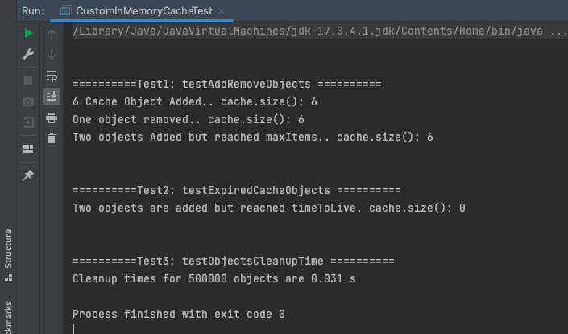

## A simple In Memory Cache In Java

### Do you have any of below questions/problems?
* caching – Lightweight Java Object cache API
* caching – Looking for simple Java in-memory cache
* How to create thread-safe in memory caching?
* Simple Caching for Java Applications
* Simple Java Caching System - Then this simple Cache implementation is for you.

### Screenshot of the Cache Console Output
